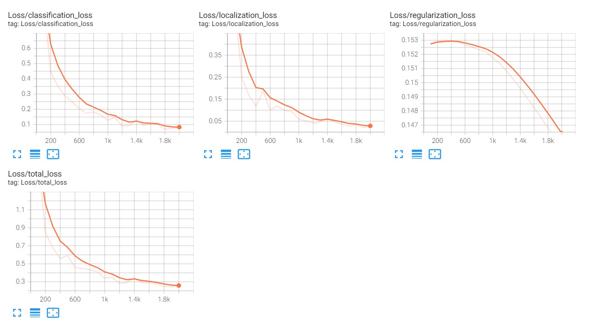

# Model Development

Develop and train a custom object detection model using SSD MobileNet V2 FPNLite 320x320 with Tensorflow Object Detection API. Training with **2000** training steps to classify and locate **20** different classes and achieved a total loss of **0.2589** on the training set and **0.7395** on the validation set. The loss on the validation set includes 0.3866 classification loss, 0.2071 localization loss and 0.1458 regularization loss. <br/>
<br/>

<br/>
<p align="center">
  <i>(Training graph)</i>
</p>
<br/>
Citation : <br/>
<br/>

```
@misc{tensorflowmodelgarden2020,
  author = {Hongkun Yu, Chen Chen, Xianzhi Du, Yeqing Li, Abdullah Rashwan, Le Hou, Pengchong Jin, Fan Yang,
            Frederick Liu, Jaeyoun Kim, and Jing Li},
  title = {{TensorFlow Model Garden}},
  howpublished = {\url{https://github.com/tensorflow/models}},
  year = {2020}
}
```
